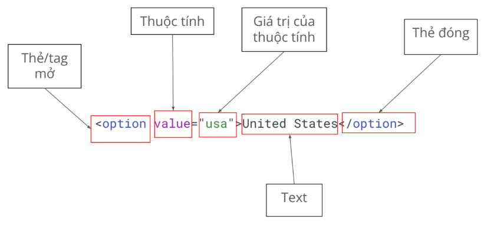
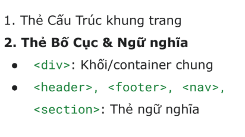
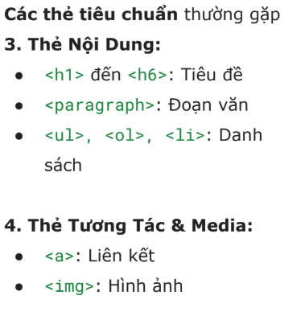
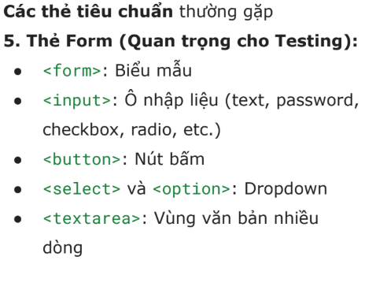

# Kiến thức được học trong buổi 5
## 1. DOM
- Máy tính sẽ “nhìn” ở dưới dạng “cây có cấu trúc”
    - Mở cây này bằng cách bấm phím F12; sau đó chọn tab “Element”.
    - Cấu trúc này gọi là DOM (Document Object Model)

### 1.1 Các thẻ HTML thường gặp
- Các thẻ tiêu chuẩn thường gặp

## 2. Selector
- Có 3 loại selector thường dùng:
    - XPath
        - Dùng được trong hầu hết các trường hợp (99.99%)
        - Đa dạng, có khả năng tìm các phần tử khó
        - Hơi dài
    - CSS selector
        - Ngắn gọn, performance cao
        - Dùng cho các trường hợp dễ tìm.
        - Không linh hoạt bằng XPath
    - Playwright selector
        - Chỉ dùng riêng cho Playwright
        - Cú pháp ngắn gọn, không phụ thuộc vào cấu trúc DOM
        - Hướng tới “giống người dùng đang nhìn thấy gì”

- Khi nào thì dùng gì => Playwright selector > CSS Selector > XPath
    - Vẫn cần học hiểu cả ba loại để có thể “cân” được mọi loại dự án.
    - Có những dự án “thích” dùng CSS, “thích” dùng XPath, ta buộc phải tuân theo.

### 2.1 Xpath Selector
- XPath = XML Path
- Có 2 loại:
    - Tuyệt đối: đi dọc theo cây DOM => bắt đầu bởi 1 /
    - Tương đối: tìm dựa vào đặc tính => bắt đầu bởi 2 //
- Nên dùng Xpath tương đối

- Khi nào dùng gì?
    - Dùng tương đối (//): 99% trường hợp
    - Tránh tuyệt đối (/): Chỉ khi bạn chắc chắn cấu trúc không đổi
- **Mẹo: Luôn kết hợp với attributes như @id, @class, @name để XPath
chính xác hơn!**