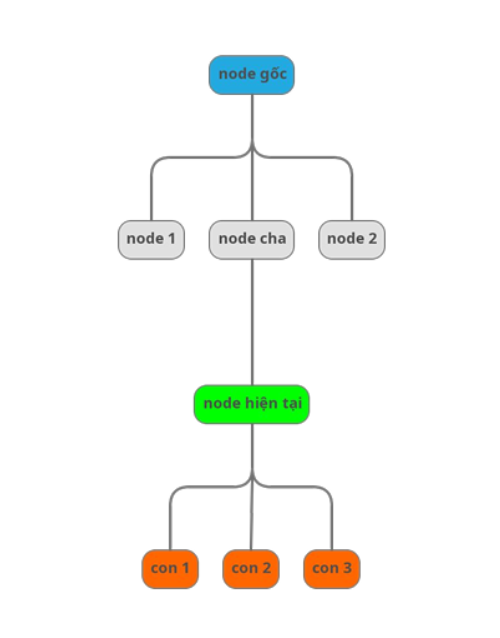
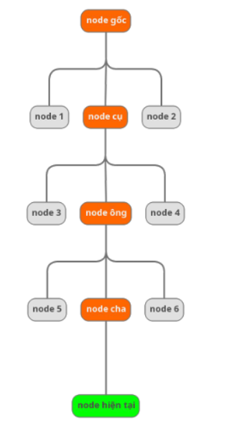
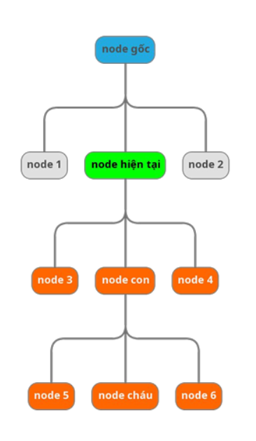
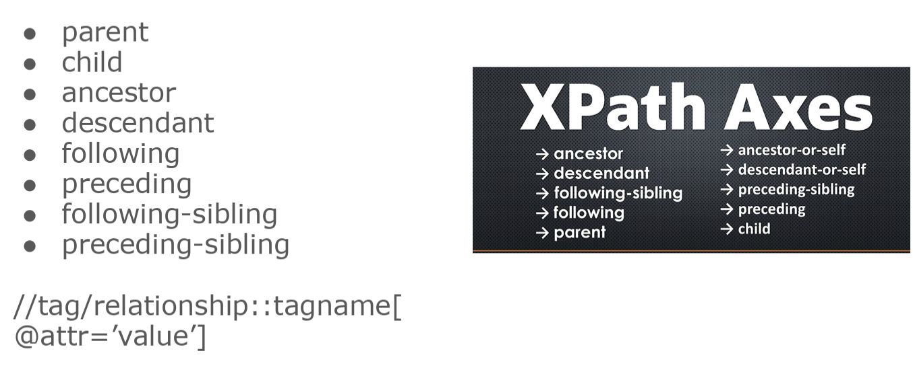
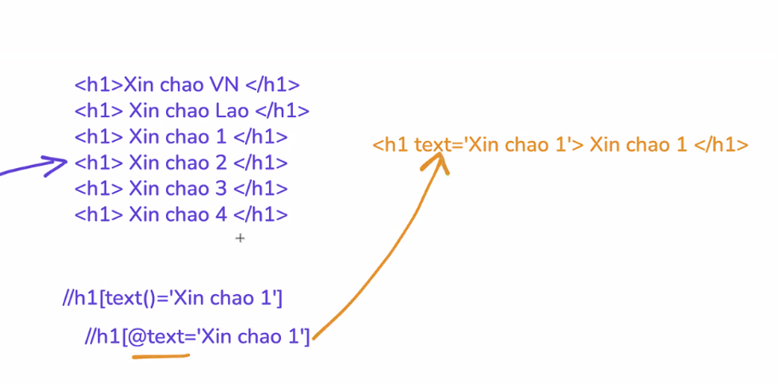

# Kiến thức được học trong buổi 7 (Selector Advanced)
## 1. DOM

### 1.1 Quy ước
- node gốc
- node hiện tại
- node cần chú ý

### 1.2 Relation
- self: node hiện tại
- parent: cha (là node phía trên trực tiếp của node hiện tại)
- children: con (là node phía dưới trực tiếp của node hiện tại)

- ancestor: tổ tiên (là các node cha, node ông, node cha của ông,...)

- descendant: hậu duệ (là các node con, node cháu, node chắt,..)

- sibling: anh em (phần tử cùng cấp và cùng cha)
- following: theo sau (các node ở phía bên phải của node hiện tại)(ko dc tính con của node đó, tính con của node khác dc)
- preceding: phía trước (các node ở phía bên tay trái của node hiện tại)(ko dc tính cha của node đó, tính cha  của node khác dc)
- following-sibling: anh em phía sau
- preceding-sibling: anh em phía trước

## 2. XPath advance

- XPath axes methods (phương thức trục XPath) là các phương pháp để điều hướng và chọn các node trong cây DOM XML/HTML dựa trên mối quan hệ giữa các node với nhau.

Công dụng:
- Tìm kiếm elements dựa trên vị trí tương đối (parent, child, sibling, ancestor...)
- Linh hoạt hơn việc chỉ dùng đường dẫn tuyệt đối hoặc tương đối

- Wildcard: * => Nghĩa là khớp tất cả
    - Ví dụ:
        - //div => khớp thẻ div
        - //* => khớp tất cả các loại thẻ

- child => Con trực tiếp
    - Ví dụ:
        - Tìm tất cả các button con trực tiếp của form => //form[@id='test-form']/child::button

- Descendant => Tất cả con cháu
    - Ví dụ:
        - Tìm tất cả input bên trong form (mọi cấp) => //form[@id='test-form']/descendant::input

- parent => Tìm cha
    - Ví dụ:
        - Tìm form cha của button "Create Test Case" => //button[text()='Create Test Case']/parent::form

- ancestor => Tìm tổ tiên
    - Ví dụ:
        - Từ button "Edit" trong table, tìm table tổ tiên => //button[@class='btn-edit']/ancestor::table

- following-sibling => Anh em phía sau
    - Ví dụ:
        - Từ label "Test Case Name", tìm input cùng cấp ngay sau nó => //label[@for='testName']/following-sibling::input
        - Từ cột "Test Name" có text "Login Validation", lấy các cột tiếp theo => //td[text()='Login Validation']/following-sibling::td

- preceding-sibling => Anh em đứng trước
    - Ví dụ:
        -  Từ button "Reset Form", tìm button đứng trước nó => //button[@class='btn-reset']/preceding-sibling::button

- following - Tất cả node sau trong document
    - Ví dụ:
        - Từ h2 "Test Cases List", tìm tất cả button "Run Test" phía sau => //h2[text()='Test Cases List']/following::button[@class='btn-run']

- ancestor-or-self => Tổ tiên hoặc chính nó
    - Ví dụ:
        -  Tìm tất cả span status trong table (bao gồm cả chính nó nếu là span) => //table[@id='test-table']/ancestor-or-self::span[contains(@cla ss, 'status')]

- preceding => Tất cả node trước trong document
    - Ví dụ:
        - Từ h2 "Test Execution Results", tìm tất cả td có text "High" phía trước => //h2[text()='Test Execution Results']/preceding::td[@class='priority-high']

- descendant-or-self => Con cháu hoặc chính nó
    - Ví dụ:
        - Tìm tất cả span status trong table (bao gồm cả chính nó nếu là span) => //table[@id='test-table']/descendant-or-self::span[contains(@ class, 'status')]

- axes

- Chứa thuộc tính: @attribute
    - Ví dụ:
        - //tagname[@attribute='value']

- AND và OR operators
    - Ví dụ:
        - //element[@condition1 and @condition2]
        - //element[@condition1 or @condition2]

- Lấy text bên trong element
    - Ví dụ:
        - //element[text()='exact text']

- normalize-space(): Chuẩn hóa khoảng trắng Loại bỏ khoảng trắng thừa ở đầu, cuối và giữa text.
    - Ví dụ:
        - normalize-space(string)

- contains(): Kiểm tra chứa chuỗi con Tìm element có chứa một phần text, không cần khớp chính xác.
    - Ví dụ:
        - //element[contains(@attribute, 'substring')]
        - //element[contains(text(), 'substring')]

- Text thì ko dùng @, @ là lấy thuộc tính
- Nhiều trường hợp có nhiều dấu cách => phải chuẩn hóa bằng normalize-space(string) => thay cho text
    - Hoặc dùng contains => //h2[contains(text(), ‘Du lịch Hà Nội’)]
